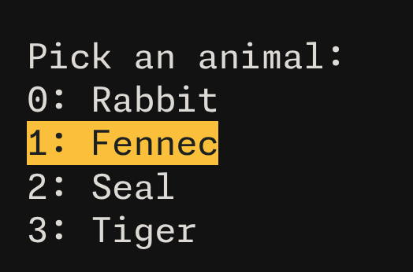
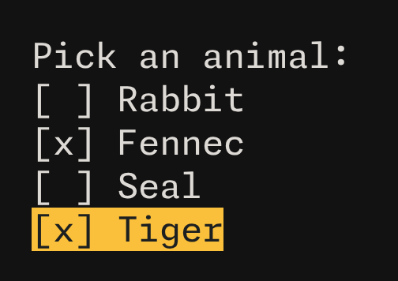

# Rust Terminal Prompt Toolkit

Example:



```rust
let selected = Selector::run(
    "Pick an animal:".to_string(),
    vec![
        "Rabbit".to_string(),
        "Fennec".to_string(),
        "Seal".to_string(),
        "Tiger".to_string(),
    ],
    Some(1),
);
```



```rust
let selections = MultiSelector::run(
    "Pick an animal:".to_string(),
    vec![
        "Rabbit".to_string(),
        "Fennec".to_string(),
        "Seal".to_string(),
        "Tiger".to_string(),
    ],
    HashSet::from([1]),
);
```
