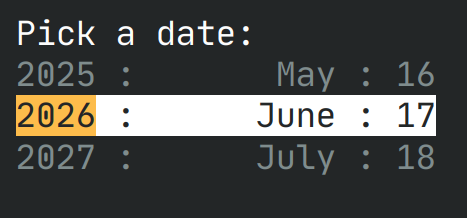
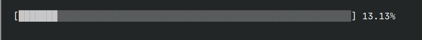
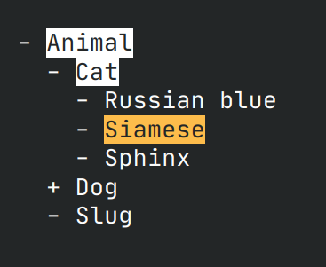

# Rust Terminal Prompt Toolkit

Example:


```rust
let selected = Selector::run(
    "Pick an animal:".to_string(),
    vec![
        "Rabbit".to_string(),
        "Fennec".to_string(),
        "Seal".to_string(),
        "Tiger".to_string(),
    ],
    Some(1),
);
```


```rust
let selections = MultiSelector::run(
    "Pick an animal:".to_string(),
    vec![
        "Rabbit".to_string(),
        "Fennec".to_string(),
        "Seal".to_string(),
        "Tiger".to_string(),
    ],
    HashSet::from([1]),
);
```



```rust
let selection = DateSelector::run("Pick a date:".to_string(), None);
```



```rust
let mut loading_bar = LoadingBar::new(99);

for i in 0..100 {
    thread::sleep(Duration::from_millis(200));
    loading_bar.set(i);
}

loading_bar.complete();
```



```rust
struct NodeImpl {
    title: String,
    children: Vec<Self>,
}

impl TreeNodeItem for NodeImpl {
    fn children(&self) -> Vec<Box<dyn TreeNodeItem>> {
        // ...
    }

    fn to_tree_item_repr(&self) -> String {
        format!("{}", self.title)
    }
}

let nodes = NodeImpl::new(
    "Animal".to_string(),
    vec![
        NodeImpl::new(
            "Cat".to_string(),
            vec![
                NodeImpl::new("Russian blue".to_string(), vec![]),
                NodeImpl::new("Siamese".to_string(), vec![]),
                NodeImpl::new("Sphinx".to_string(), vec![]),
            ],
        ),
        NodeImpl::new(
            "Dog".to_string(),
            vec![
                NodeImpl::new("Leopard hound".to_string(), vec![]),
                NodeImpl::new("Bulldog".to_string(), vec![]),
                NodeImpl::new("German shepherd".to_string(), vec![]),
                NodeImpl::new("Pitbull".to_string(), vec![]),
            ],
        ),
        NodeImpl::new("Slug".to_string(), vec![]),
    ],
);

TreeWalker::new(nodes).navigate().unwrap();
```
